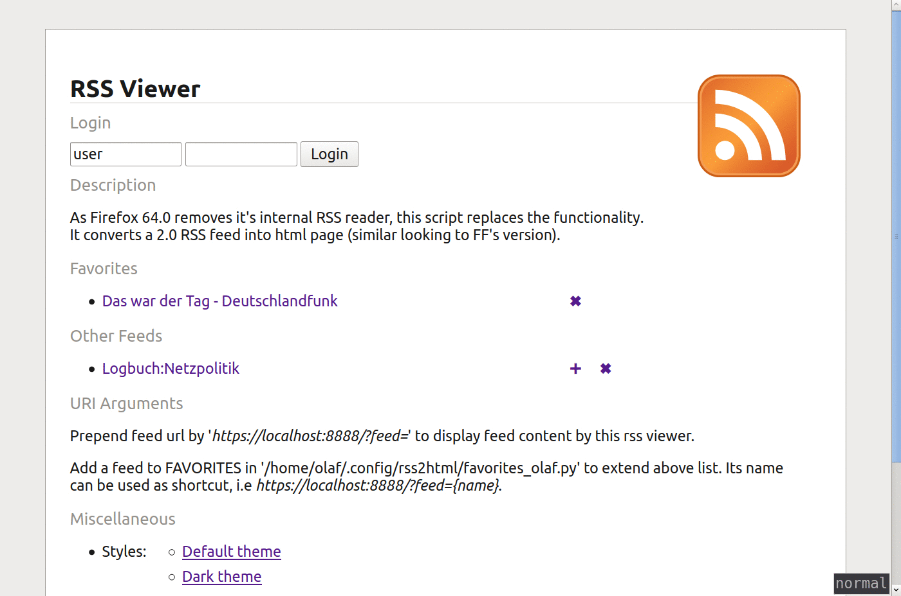

Minimal RSS Feed to Html converter 
==================================

## Info

Background daemon to convert RSS Feeds into html pages.
Representation of data is similar to Firefox's variant.

If you define a list of accounts, the server can used by multiple
users. Moreover, authenticated users can trigger some actions, like
download files, starting playback, etc.

## Requires

Python >= 3.8
pip >= 18.0  
Python packages Jinja>=2.10 babel>=2.6  

## Start

Call `make run` and visit <http://localhost:8888>

Take a look into the *Setup section* to see how you could
configure the program.  
If you want install the programm as background daemon,
call `make install_service`. It requires the systemd init system.

## Setup

1. Install unmet Python dependencies by `make check_env`.
2. (Optional) The settings are defined in *default_settings.py*.  
	If you want override values create *settings.py* and place your
	changes there:

		#!/usr/bin/python3
		# -*- coding: utf-8 -*-

		HOST = "localhost"  # "" allows access from everywhere…
		PORT = 8888
		# […]

	Place this file into *$HOME/.config/rss2html* (Linux) or  
	*%APPDATA%/rss2html* (Windows) or this folder.

3. Start background service: `python3 rss_server.py [-d]`

4. Visit *localhost:8888/?feed=[your feed url]* to view a feed.  
	The content presentation is similar to Firefox's <= 63.x.
	The feed will be stored in the history of visited feeds.

5. (Optional) Combine Firefox's 'Open with'-dialog  
	for RSS-feeds with the *rss_reader* script.  
	This will open the feed content in a new browser tab.

	(Linux)
	The list of applications in the 'Open With'-dialog
	depends from the entries in */usr/share/applications*.  

	To extend this dialog with 'rss_reader':  
	5.1 Copy *rss_reader.desktop* into above folder and  
	5.2 Copy *rss_reader* into */usr/local/bin* (or edit the path in 'rss_reader.desktop')

## Manage Favorites

The favorite feeds can be managed over the files *favorites.py* and, if multiple users are defined, *favorites_{username}.py*.

	#!/usr/bin/python3
	# -*- coding: utf-8 -*-

	from feed import Feed

	FAVORITES = [
	    Feed("example",
	         "http://www.deutschlandfunk.de/podcast-das-war-der-tag.803.de.podcast",
	         "Example Feed"),
	]

Place the file(s) into *$HOME/.config/rss2html* (Linux) or  
*%APPDATA%/rss2html* (Windows) or this folder.

The files will also be created/changed if by actions taken on the web interface.

## Adding action handlers to feeds

Two actions are predefined: Download file and play file locally.
If you want define more actions you can extend your local settings file.

### Handle action by arbitrary python function

Extend your *settings.py* by

	from default_settings import ACTIONS

	def can_action_name(feed, url, settings):
	    # Return True if your action should be possible for this url
	    # Can be used to restrict action on domain name, etc.
	    return True

	def action_name(feed, url, settings):
	    # Add your stuff here
	    return True

	ACTIONS.update({
	    "my_action" : {
	        "handler": action_name,
	        "check": can_action_name,
	        "title": "Description",
	        "icon": "icons/gnome_download.png",
	    },
	})

### Run local command
If you want call a shell command but no python function you can use
following variant:

	from default_settings import ACTIONS
	import actions

	lexample = ["notify-send", "RSS VIEWER", "{url}"]
	ACTIONS.update({
	    "play_ssh" : { 
	        "handler": actions.factory__local_cmd(lexample),
	        "check": lambda feed, url, settings: True,
	        "title": _('Local example cmd'),
	        "icon": "icons/gnome_term.png",
	    },
	})

### (Secure) way to trigger a command over SSH
This sections shows how you could define an action to
trigger a command on an other host. The allowed commands
are defined in *rss2html.sh* on the remote machine.  

1. Create new key for rss2html:
`ssh-keygen -f ~/.ssh/rss2html -P ""`

2. Copy *rss2html_ssh.sh.example* to *rss2html.sh* and add your
commands into the script. The keyword (here: PLAY) should match
with the value in step 2.  
Copy the script onto your target system.

3. Extend your *settings.py* by  

		from default_settings import ACTIONS
		import actions
	
		ssh_example = ("user@machine",
		    "{absolute path}/rss2html_ssh.sh PLAY '{url}'",
		    "~/.ssh/rss2html")
		ACTIONS.update({
		    "play_ssh" : { 
		        "handler": actions.factory__ssh_cmd(*ssh_example),
		        "check": actions.can_play,
		        "title": _('SSH Play'),
		        "icon": "icons/gnome_term.png",
		    },
		})

4. Add following line in *~/.ssh/authorized_keys* on your remote system.  
The command-prefix restricts the accesses on this single script.

	command="{absolute path}/rss2html_ssh.sh" {Content of ~/.ssh/rss2html.pub}

## Developing
### Add a new language
1. Add language code in *Makefile* to SUPPORTED_LANGS variable.
2. Run `make babel_compile`

### Update existing localization's
1. Run `make babel_prepare babel_update` to update \*.pot- and \*.po-files
2. Edit *./locale/{LANG CODE}/LC_MESSAGES/messages.po*
3. Run `make babel_compile`

## Screenshots

