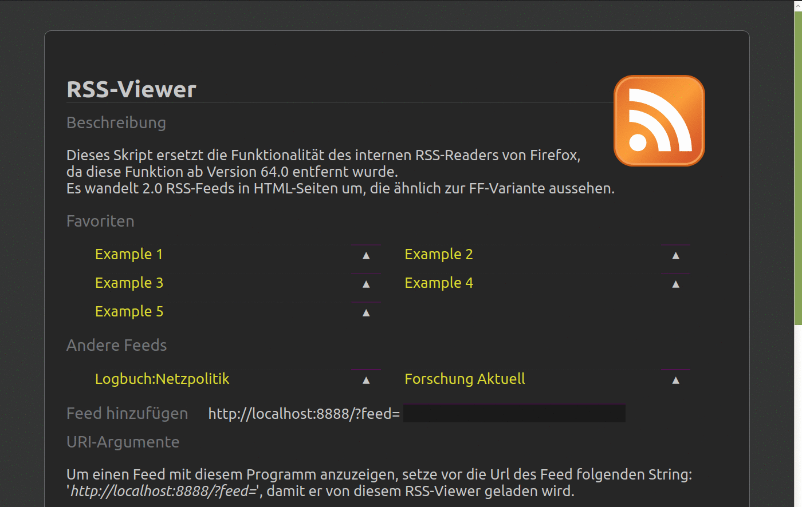

   RSS Feed to Html converter
==================================


## Info

Background daemon to convert RSS Feeds into HTML pages.
Presentation of data is similar to Firefox's variant.

A list of users and a list of actions can be defined.
Then, authenticated users can trigger commands for media files in
RSS feed.


## Requires

Python >= 3.8
For a list of required packages: see setup.cfg
For virtual environments: python3-venv


## Installation and start
### Installation by prebuild package:
```
python3 -m pip install {PATH to *.whl-file}
```
If you want build the package from its sources, see below.


### Start
Call `python3 -m rss2html` and visit <http://localhost:8888>

Take a look into the *Setup section* to see how you could
configure the program.
If you want install the programm as background daemon,
call `make install_service`. It requires the systemd init system.


### Starting directly from this repository
```
git clone "{This repo}"
cd rss2html
python3 -m pip install --target "site-packages" -U -r requirements.txt
PYTHONPATH=src:site-packages python3 -m rss2html
```


## Setup

1. Install programm and its dependencies.
2. The settings are defined in *rss2html/default_settings.py*.  
	If you want override values create *settings.py* and place your
	changes there:

```
#!/usr/bin/python3
# -*- coding: utf-8 -*-

HOST = "localhost"  # "" allows access from everywhere…
PORT = 8888
# […]
```

Place this file into *$HOME/.config/rss2html* (Linux) or *%APPDATA%/rss2html* (Windows) or this folder.

3. Start background service: `python3 -m rss2html [-d]`

4. Visit *localhost:8888/?feed=[your feed url]* to view a feed.  
	The content presentation is similar to Firefox's <= 63.x.
	The feed will be stored in the history of visited feeds.

5. (Optional) Combine Firefox's 'Open with'-dialog  
	for RSS-feeds with the *scripts/rss_reader* script.  
	This will open the feed content in a new browser tab.

	(Linux)
	The list of applications in the 'Open With'-dialog
	depends from the entries in */usr/share/applications*.  

	To extend this dialog with 'rss_reader':  
	5.1 Copy *scripts/rss_reader.desktop* into above folder and  
	5.2 Copy *scripts/rss_reader* into */usr/local/bin* (or edit the path in 'rss_reader.desktop')


## Manage Favorites

The favorite feeds can be managed over the files *favorites.py* and, if multiple users are defined, *favorites_{username}.py*.

```
#!/usr/bin/python3
# -*- coding: utf-8 -*-

from rss2html.feed import Feed

FAVORITES = [
    Feed("example",
         "http://www.deutschlandfunk.de/podcast-das-war-der-tag.803.de.podcast",
         "Example Feed"),
]
```

Place the file(s) into *$HOME/.config/rss2html* (Linux) or  
*%APPDATA%/rss2html* (Windows) or this folder.

Theese files will also be created/changed by actions taken on the web interface.


## Adding action handlers to feeds

Two actions are predefined: Download file and play file locally.
If you want define more actions you can extend your local settings file.


### Handle action by arbitrary python function

Extend your *settings.py* by

```
from rss2html.default_settings import ACTIONS

def can_action_name(feed, url, settings):
    # Return True if your action should be possible for this url
    # Can be used to restrict action on domain name, etc.
    return True

def action_name(feed, url, settings):
    # Add your stuff here
    return True

ACTIONS.update({
    "my_action" : {
        "handler": action_name,
        "check": can_action_name,
        "title": "Description",
        "icon": "icons/gnome_download.png",
    },
})
```

### Run local command
If you want call a shell command but no python function you can use
following variant:

```
from rss2html.default_settings import ACTIONS
from rss2html import actions

lexample = ["notify-send", "RSS VIEWER", "{url}"]
ACTIONS.update({
    "play_ssh" : {
        "handler": actions.factory__local_cmd(lexample),
        "check": lambda feed, url, settings: True,
        "title": _('Local example cmd'),
        "icon": "icons/gnome_term.png",
    },
})
```

### (Secure) way to trigger a command over SSH
This sections shows how you can trigger a command on an other
host by invoking a script over SSH. This needes the generation
of a new SSH Key and a binding of the script with this key.
The allowed commands are defined in *scripts/rss2html.sh* on the remote machine.

**Hint:** Step 1-3 can be completed by *scripts/install_ssh.sh*

1. Create new key for rss2html: `ssh-keygen -f ~/.ssh/rss2html -P ""`

2. Copy *scripts/rss2html_ssh.sh.example* to *rss2html.sh* and add your
  commands into the script. The keyword (here: PLAY) should match
  with the value in step 2.
  Copy the script onto your target system.

3. Add following line in *~/.ssh/authorized_keys* on your remote system.
  The command-prefix restricts the accesses on this single script.
	`command="{absolute path}/rss2html_ssh.sh" {Content of ~/.ssh/rss2html.pub}`

4. Extend your *settings.py* to propagate commands to webinterface by

```
from rss2html.default_settings import ACTIONS
from rss2html import actions

ssh_args = ("user@machine", "PLAY '{url}'", "~/.ssh/rss2html")
ACTIONS.update({
    "play_ssh" : {
        "handler": actions.factory__ssh_cmd(*ssh_args),
        "check": actions.can_play,
        "title": _('SSH Play'),
        "icon": "icons/gnome_term.png",
    },
})
# ... Other
```

## Developing
### Requirements
lessc, babel
`apt install python3-babel node-less`

### Bulding package

Creates new package in *dist*:
```
apt install python3-venv
python3 -m pip install --upgrade build
python3 -m build
```


### Installation in new virtual environment
```
python3 -m venv 'my_venv'
source my_venv/bin/activate
python3 -m pip install dist/rss2html-{VERSION}.whl 
```

### Add a new language
1. Add language code in *Makefile* to `SUPPORTED_LANGS` variable.
2. Run `make babel_compile`


### Update existing localization's
1. Run `make babel_prepare babel_update` to update \*.pot- and \*.po-files
2. Edit *./locale/{LANG CODE}/LC_MESSAGES/messages.po*
3. Run `make babel_compile`


## Screenshots
[](screenshots/README.md)
